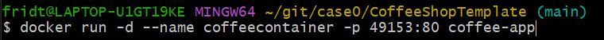

1.

//builds the image named coffee-app (have to be in the coffeeshop)
docker build . -t coffee-app

2.

//runs container. Create your own name. Opens to port 80. Internal is 49153. 
docker run -d --name contosocontainer -p 49153:80 coffee-app

3.

Make a new container registry in Azure. I called it contosocoffeeregistry.

4.

//tags the image to azurecr.io (the registry in Azure)
docker tag coffee-app contosocoffeeregistry.azurecr.io/coffee-app

5.

//make sure youre logged into Azure (docker login <insert name>.azurecr.io). Pushes image to azurecr.io
docker push contosocoffeeregistry.azurecr.io/coffee-app

